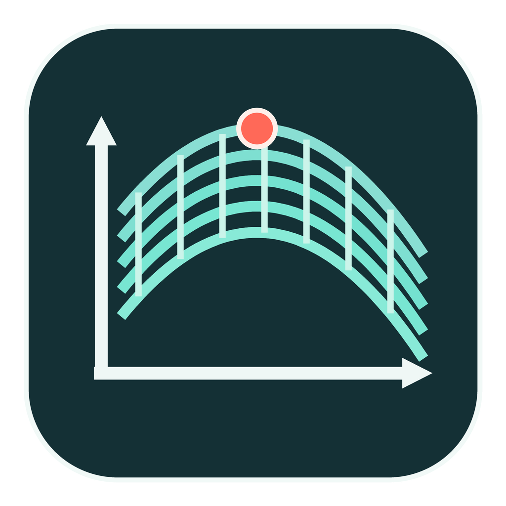

# sDOE

DOE 실험설계 생성, 결과 입력, RSM 분석을 한 화면에서 수행하는 한국어 Streamlit 데스크톱 앱입니다.



## 주요 기능

- 2요인 또는 3요인 DOE 설계 생성
- CCD, CCI, CCF, Box-Behnken, 완전요인 설계 지원
- Batch별 실행 수와 중심점 분배, seed 기반 실행순서 랜덤화
- CSV/XLSX 업로드 및 표 직접 입력
- 최대 6개 반응값(Y1-Y6)과 사용자 정의 요인·반응 이름
- Full quadratic RSM 모델 적합
- 2D contour, 회전 가능한 3D surface, contour profiler, prediction profiler
- Predicted plot, ANOVA, lack of fit, 계수와 적합도 출력
- 정상점 계산, Hessian 고유값 기반 최대·최소·안장점 분류
- CSV, Excel, HTML, PNG, GLB 결과 저장
- pywebview 기반 Windows 데스크톱 실행 및 Inno Setup 설치본

## Python으로 실행

Python 3.12 환경을 권장합니다.

```powershell
python -m venv .venv
.\.venv\Scripts\Activate.ps1
python -m pip install -r requirements.txt
python rsm_streamlit_app.py
```

또는 Streamlit 명령으로 실행할 수 있습니다.

```powershell
streamlit run rsm_streamlit_app.py
```

## Windows 설치본 빌드

필요 항목:

- Python 3.12
- [Inno Setup 6](https://jrsoftware.org/isinfo.php)

프로젝트 루트에 빌드용 가상환경을 준비합니다.

```powershell
python -m venv .venv-build-py312
.\.venv-build-py312\Scripts\python.exe -m pip install -r requirements-build.txt
powershell -NoProfile -ExecutionPolicy Bypass -File .\build_installer.ps1
```

완성된 설치 파일은 `installer_output` 폴더에 생성됩니다. 설치본에는 Python과 pywebview 의존성이 포함되므로 사용자 PC에 별도로 설치할 필요가 없습니다. Windows WebView2 Runtime은 운영체제에 설치되어 있어야 합니다.

## 파일 구성

- `rsm_streamlit_app.py`: 앱 진입점
- `rsm_design.py`, `rsm_design_ui.py`: 실험설계 생성과 UI
- `rsm_core.py`, `rsm_statistics.py`: RSM 적합과 통계 계산
- `rsm_plots.py`, `rsm_dashboard.py`: 그래프와 분석 화면
- `rsm_result_ui.py`, `rsm_table_component.py`: 결과 입력과 표 편집
- `rsm_export.py`, `rsm_3d.py`: Excel 및 3D 파일 내보내기
- `rsm_desktop_launcher.py`: pywebview 데스크톱 런처
- `rsm_desktop.spec`, `rsm_setup.iss`: Windows 패키징 설정

## 데이터 형식

요인 열은 `X1`, `X2`, 선택적으로 `X3`를 사용합니다. 반응 열은 `Y1`부터 `Y6`까지 지원합니다. 앱에서 생성한 실험계획 CSV를 사용하면 실행순번, Batch, 포인트 유형, 실제 요인값과 coded 값이 함께 유지됩니다.

